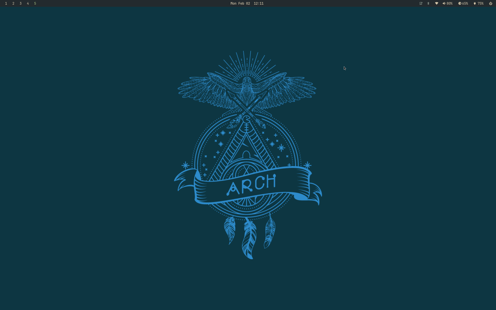
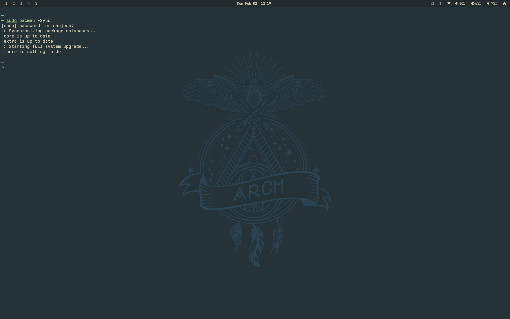
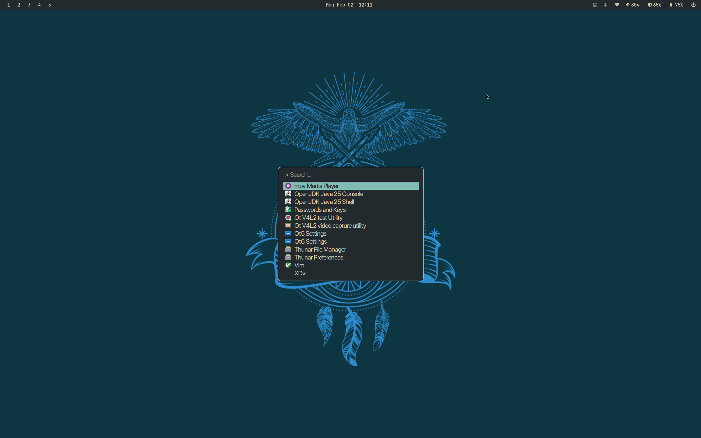
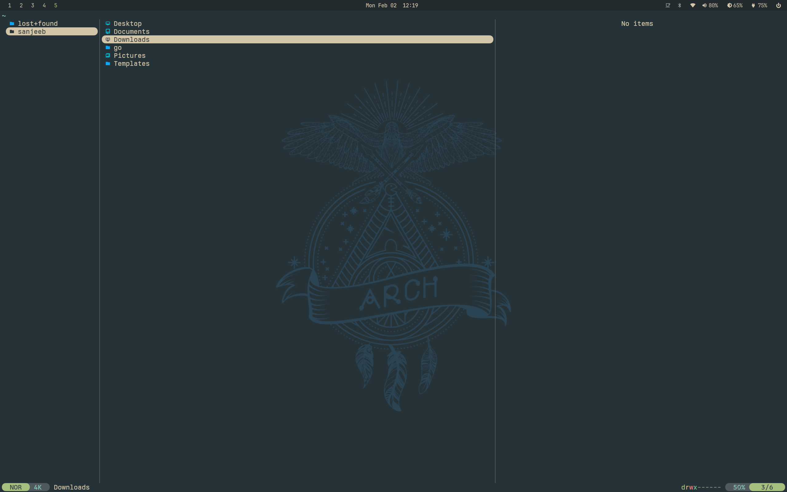
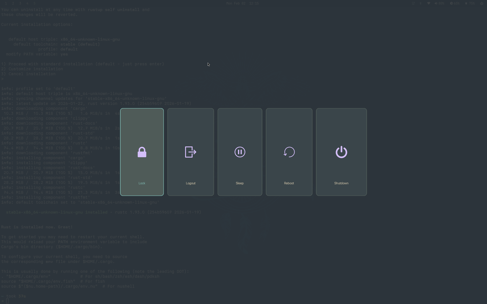

# Hyprland Dotfiles

My personal Arch Linux + Hyprland configuration featuring a cohesive **Everforest Dark Hard** theme across all applications.



---

## Features

- **Window Manager:** Hyprland with smooth animations and smart gaps
- **Color Scheme:** Everforest Dark Hard — warm, green-based, easy on the eyes
- **Status Bar:** Waybar with minimal, functional modules
- **Terminal:** Kitty with transparency
- **App Launcher:** Fuzzel with fzf-style matching
- **Notifications:** Mako with urgency-based styling
- **Shell:** Zsh with Starship prompt, zoxide, fzf, and modern CLI tools
- **Editor:** Neovim with Lazy.nvim plugin manager
- **File Manager:** Yazi (terminal) + Thunar (GUI)
- **Lock Screen:** Hyprlock with blurred screenshot background
- **Idle Management:** Hypridle with progressive dimming → lock → sleep

---

## Screenshots

<!-- Add your screenshots here -->





---

## Dependencies

### Core
```
hyprland hyprpaper hyprlock hypridle hyprsunset hyprpolkitagent
waybar mako fuzzel wlogout
kitty
```

### Shell & CLI Tools
```
zsh starship zoxide fzf fd ripgrep eza bat
zsh-autosuggestions zsh-syntax-highlighting zsh-history-substring-search
```

### Utilities
```
grim slurp wl-clipboard cliphist          # Screenshots & clipboard
brightnessctl playerctl wpctl             # Hardware controls
blueman networkmanager nm-connection-editor
thunar yazi                               # File managers
gnome-keyring polkit-gnome
```

### Fonts
```
ttf-jetbrains-mono-nerd
ttf-berkeley-mono-nerd (AUR)
ttf-sf-pro (AUR)
inter-font
noto-fonts noto-fonts-cjk noto-fonts-emoji
```

### Theming
```
papirus-icon-theme
nwg-look                                  # GTK settings
qt5ct qt6ct                               # Qt theming
```

### Applications
```
neovim
google-chrome (AUR) / firefox
pavucontrol                               # Audio control
```

---

## Installation

### 1. Clone the repository
```bash
git clone https://github.com/YOUR_USERNAME/dotfiles.git ~/.local/dotfiles
cd ~/.local/dotfiles
```

### 2. Install GNU Stow
```bash
sudo pacman -S stow
```

### 3. Stow the dotfiles
```bash
# From inside the dotfiles directory
stow .
```

This will symlink all configurations to their appropriate locations:
- `.config/*` → `~/.config/*`
- `.zshenv` → `~/.zshenv`

### 4. Set Zsh as default shell
```bash
chsh -s $(which zsh)
```

### 5. Log out and back in
Restart your session to apply all changes.

---

## Structure

```
~/.local/dotfiles/
├── .config/
│   ├── hypr/                # Hyprland, hyprlock, hypridle, hyprpaper, hyprsunset
│   ├── waybar/              # Status bar config and styling
│   ├── kitty/               # Terminal emulator
│   ├── fuzzel/              # App launcher
│   ├── mako/                # Notifications
│   ├── wlogout/             # Power menu
│   ├── nvim/                # Neovim (Lazy.nvim)
│   ├── zsh/                 # Zsh config, history
│   ├── starship/            # Prompt configuration
│   ├── yazi/                # Terminal file manager
│   ├── fontconfig/          # Font rendering & fallbacks
│   ├── gtk-3.0/             # GTK3 theme settings
│   ├── gtk-4.0/             # GTK4 theme settings
│   ├── nwg-look/            # GTK appearance tool config
│   └── environment.d/       # Systemd user environment
├── .zshenv                  # Environment variables & XDG paths
├── .gitignore
└── README.md
```

---

## Key Bindings

| Binding | Action |
|---------|--------|
| `Super` | Open Fuzzel (app launcher) |
| `Super + Return` | Open Kitty terminal |
| `Super + Q` | Close window |
| `Super + W` | Open browser |
| `Super + E` | Open Yazi (file manager) |
| `Super + R` | Open Thunar |
| `Super + M` | Maximize window |
| `Super + F` | Toggle floating |
| `Super + N` | Minimize to scratchpad |
| `Super + Shift + N` | View minimized windows |
| `Super + V` | Clipboard history |
| `Super + Shift + S` | Screenshot region to clipboard |
| `Super + Print` | Screenshot full screen to file |
| `Super + Backspace` | Power menu (wlogout) |
| `Super + 1-0` | Switch workspace |
| `Super + Shift + 1-0` | Move window to workspace |
| `Super + Arrow Keys` | Move focus |
